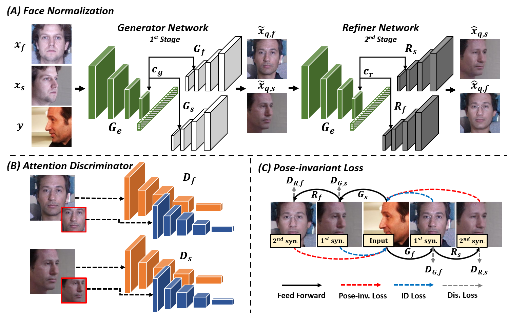
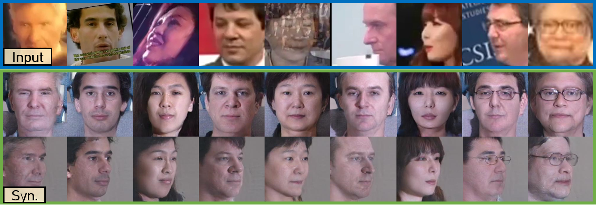

# Dual-View Normalization for Face Recognition
This repository will give the evaluation code for *Dual-View Normalization for Face Recognition*.





Overview
--
Face normalization refers to a family of approaches that rotate a non-frontal face to a frontal pose for better handling of face recognition. While a great majority of face normalization methods focus on frontal pose only, we proposed a framework for dual-view normalization that generates a frontal pose and an additional yaw-45 pose to an input face of arbitrary pose. The contribution of this work can be summarized as follows:
- Different from the existing face normalization approaches which consider the frontal pose as the only normalized view, the proposed DVN framework defines normalization in dual views, one in frontal view and the other in yaw-$45^{\circ}$ side view. The additional side-view normalization can better represent a face, leading to a better recognition performance. 
- The proposed DVN integrates identity preservation, face normalization and pose transformation so that it can transform a face of an arbitrary pose to specific normalized poses with identity well retained.      
- The proposed DVN is verified highly competitive to state-of-the-art methods for face recognition.

Here some dual-view normalization results:


Pre-requisites
-- 
- Python3
- CUDA 9.0 or higher
- Tensorflow 1.14.0
- Pyotorch 
- Numpy 1.16.2
- Opencv


Datasets
--
In this paper, we use two face datasets, and all face images are normalized to 250x250 according to landmarks. According to the five facial points extracted by [MTCNN](https://arxiv.org/abs/1604.02878), please follow the align protocol in the [paper]().
- **Multi-PIE** All the subjects in Multi-PIE were chosen for training and further divided into two normal sets, i.e., front- and side-view normal set, in neural expression with 5 illumination conditions.
- **CAISA-WebFace** We use CASIA-WebFace as source set in unconstrained experiment. Surely you can download other face dataset such as VGGFace2 and MS-Celeb-1M as unconstrained input. 
 
 
Procedure to evaluate the model
--
1. Clone the Repository to preserve Directory Structure. 
2. Download the [encoder model](https://drive.google.com/open?id=1yk_GN-rKWitRiw_6iXE0bEZu4G_rRfPT), unzip it and put the models in **/Pretrained/** directory.
3. Download the [DVN model](https://drive.google.com/open?id=1-GPU7OBgUJydpRW1YWaojir_BSSr3_X_), unzip it and put the models in **/Pretrained/DVN/** directory.
4. For data evaluation, put the images in **/Eval/Src_Img/** folder. 
5. After step 4, change the directrory to **/FaceAlignment/** (*cd FaceAlignment*), and crop the input face images by running:
```python face_align.py```
6. After step 5, go back to previous directory (*cd ..*), and generate the dual-view normalized faces by running:
```python test.py --checkpoint_ft model_path in step.3```
7. The normalized faces will be stored in **/Eval/Face_Syn/** folder.

 
Citation
--
```
```
Please feel free to contact us if you have any questions. Prof. Gee-Sern Jison Hsu e-mail: jison@mail.ntust.edu.tw
