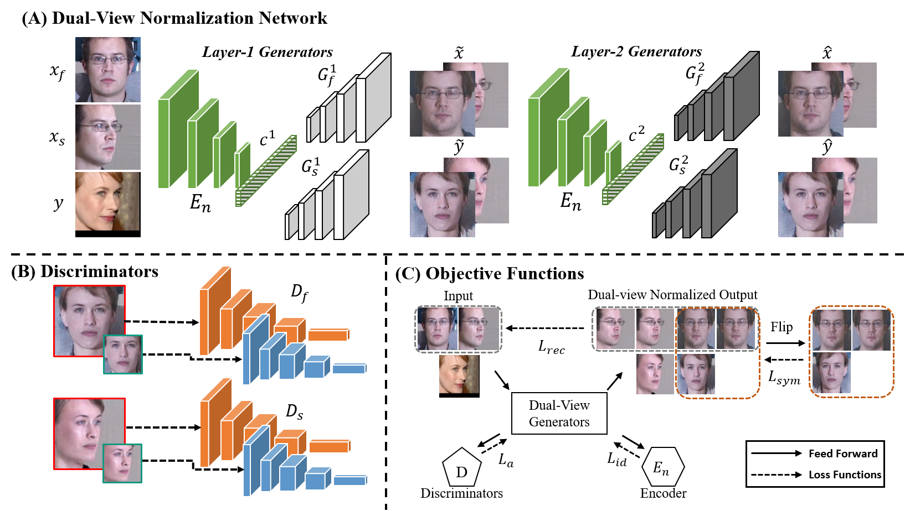

# Dual-View Normalization for Face Recognition
This repository will give the evaluation code for *Dual-View Normalization for Face Recognition*.





Overview
--
Face normalization refers to a family of approaches that rotate a non-frontal face to a frontal pose for better handling of face recognition. While a great majority of face normalization methods focus on frontal pose only, we proposed a framework for dual-view normalization that generates a frontal pose and an additional yaw-45 pose to an input face of arbitrary pose. The contribution of this work can be summarized as follows:
- Different from most previous work primarily on pose normalization, our proposed approach normalizes faces in dual-view (i.e., front-view face and face in 45 side-view).
- We propose the refiner framework, which can be considered as an additional layer of the generators, to correct wrongly recovered parts of the normalized faces. The pose-invariant loss has been considered bot be the penalty mechanism for training.
- We propose a novel scheme to fuse multiple face representations, i.e. source input, front- and side-view normalized face representation, to a single representation, which is show to boost the performance significantly.
- The proposed approach offers a comprehensive study on the combination of various loss functions, extending the understanding of their influences on the generated images.
- The proposed approach is verified to be highly competitive to state-of-the-art methods for face recognition.


Pre-requisites
-- 
- Python3
- CUDA 9.0 or higher
- Install [Pytorch](https://pytorch.org/) following the website for face cropped.
- Install [Tensorflow](https://www.tensorflow.org/) following the website for image synthesizeation.

 

Datasets
--
In this paper, we use two face datasets, and all face images are normalized to 250x250 according to landmarks. According to the five facial points extracted by [MTCNN](https://arxiv.org/abs/1604.02878), please follow the align protocol in the [paper]().
- **Multi-PIE** All the subjects in Multi-PIE were chosen for training and further divided into two normal sets, i.e., front- and side-view normal set, in neural expression with 5 illumination conditions.
- **CAISA-WebFace** We use CASIA-WebFace as source set in unconstrained experiment. Surely you can download other face dataset such as VGGFace2 and MS-Celeb-1M as unconstrained input. 
 
 
Procedure to evaluate the model
--
1. Clone the Repository to preserve Directory Structure. 
2. Download the [encoder model](https://drive.google.com/open?id=1yk_GN-rKWitRiw_6iXE0bEZu4G_rRfPT), unzip it and put the models in **/Pretrained/** directory.
3. Download the [DVN model](https://drive.google.com/open?id=1-GPU7OBgUJydpRW1YWaojir_BSSr3_X_), unzip it and put the models in **/Pretrained/DVN/** directory.
4. For evaluation data, put the images in **/Eval/Src_Img/** folder. 
5. After step 4, change the directrory to **/FaceAlignment/**(*cd FaceAlignment*), and crop the input face images by running:
```python face_align.py```
6. After step 5, go back to previous directory (*cd ..*), and generate the dual-view normalized faces by running:
```python test.py --checkpoint_ft model_path in step.1```
5. The normalized faces will be stored in **/Eval/Face_Syn** folder.


 
Citation
--
```
```

License 
--
Please feel free to contact us if you have any questions.

Prof. Jison Hsu's e-mail: jison@mail.ntust.edu.tw
